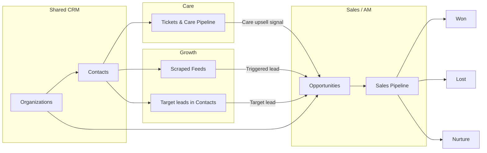
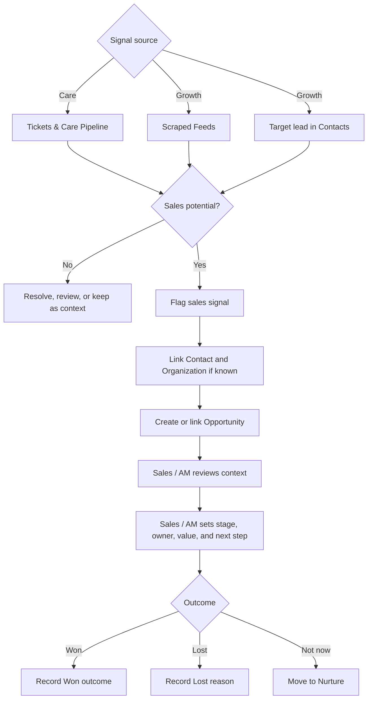
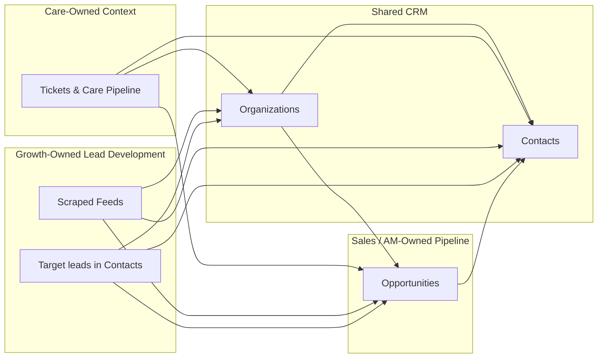

# Care & Sales Base

## Executive Summary

The Care & Sales Base is the shared customer lifecycle base for EDU Passport.

It connects Care, support, scraped market signals, ticket feedback, and Sales / Account Management in one place so the team can see the full customer journey without duplicating contacts or losing handoff context.

Companion docs:

- [Manual Test Scenarios](manual-test-scenarios.md)
- [Airtable AI Prompts](airtable-ai-prompts.md)

Care owns the customer signal:

- support tickets
- upsell potential
- scraped external leads
- customer feedback inside tickets
- customer satisfaction and service context

Sales owns the commercial follow-up:

- opportunity stage
- sales owner
- estimated value
- probability
- next step
- expected close date
- won, lost, or nurture outcome

Growth owns lead development:

- triggered lead review
- target lead research
- preferred contact method tracking
- repeat poster follow-up
- sales categories such as adverts, consulting, sponsorship, and membership

The main operating rule is:

**Care detects signals. Sales manages opportunities.**

This base should stay simple. Care tables explain what happened with the customer. The Opportunities table explains what Sales is doing next.

## Purpose

The Care & Sales Base helps the team manage:

- customer support and service issues
- scraped external leads
- customer feedback inside tickets
- upsell signals
- triggered and target lead follow-up
- sales and account management opportunities

It is not meant to become a heavy finance, contract, or task-management system. It is the shared place where customer context becomes qualified commercial follow-up.

## Core Principle

Care detects signals. Sales manages opportunities.

A Care record should explain what happened with the customer. An Opportunity should explain what Sales is doing next.

## Main Tables

### Contacts

Contacts stores individual people.

Use this table for:

- educators
- business users
- vendors
- admins
- leads
- existing platform users

Contacts should not become a sales pipeline. A contact can have many tickets, scraped feed matches, and opportunities.

Important Growth-related fields:

- `Email`
- `Phone / WhatsApp`
- `WeChat ID`
- `Social Handle`
- `Preferred Contact Method`
- `Lead Source Type`

### Organizations

Organizations stores schools, businesses, vendors, partners, and other institutions.

Use this table for:

- schools
- companies
- vendors
- partners
- key accounts
- institutions with multiple contacts

Organizations should not become the sales pipeline. It gives account-level context.

One Organization can have many Contacts, tickets, scraped feed matches, and opportunities.

Example:

- Organization: Bright Future School
- Contacts: principal, teacher, admin staff
- Opportunities: premium plan discussion, renewal, expansion
- Tickets: support issues from staff at that school

### Tickets & Care Pipeline

Tickets & Care Pipeline stores support and service conversations.

Use this table when a customer has:

- a technical issue
- account access problem
- billing question
- feature request
- general inquiry
- support conversation with upsell potential

Important Sales-related fields:

- `upsell potential`
- `opportunities`
- `Sales Handoff Status`

If `upsell potential` is checked, Care is saying: "This ticket may be useful for Sales."

The `opportunities` field links the ticket to the Sales opportunity created from that signal.

### Scraped Feeds

Scraped Feeds stores external posts or market signals found outside EDU Passport.

Use this table for:

- job posts
- deal posts
- event posts
- external listings
- repeated posters
- contact details collected from public sources

If a scraped feed looks like a possible lead, link it to an Opportunity.

Important Growth-related fields:

- `Post Type`
- `Source URL`
- `Raw Contact Info`
- `Cleaned Email`
- `WeChat ID`
- `WhatsApp`
- `Social Handle`
- `Phone`
- `Repeat Poster Flag`
- `Existing User Cross-Check`
- `Sales Handoff Status`
- `opportunities`

### Opportunities

Opportunities is the Sales and Account Management pipeline.

Use this table only when Sales has something to manage.

An Opportunity may come from:

- a Care ticket
- a scraped feed
- a referral
- manual Sales entry
- an existing customer conversation

Sales owns these fields:

- stage
- owner
- opportunity type
- lead source type
- estimated value
- probability
- expected close date
- next step
- next step due date
- closed date
- lost reason
- notes

Use `Opportunity Type` to classify what Sales or Growth is trying to sell:

- `Advert`
- `Consulting`
- `Sponsorship`
- `Membership`
- `Upsell`
- `Triggered Lead`

Use `Lead Source Type` to explain where the opportunity came from:

- `Care Upsell`
- `Triggered Lead`
- `Target Lead`
- `Manual Research`
- `Referral`

Use `Lead Source Type` on Contacts to explain where the lead/contact came from. Use it on Opportunities to explain where the sales opportunity came from.

Use `Preferred Contact Method` on Contacts to identify the best outreach channel:

- `Email`
- `WeChat`
- `WhatsApp`
- `Social Handle`
- `Phone`

## Table Relationships

```text
Organizations ----------> Contacts
      |                     |
      |                     v
      |              Tickets & Care Pipeline ----\
      |              Scraped Feeds ---------------+--> Opportunities
      |                                            ^
      +--------------------------------------------+
```

Contacts and Organizations are shared CRM context.

```text
Tickets & Care Pipeline ----\
Scraped Feeds ---------------+--> Opportunities
```

Tickets and scraped feeds are the two source tables that can produce sales signals.

Care primarily works tickets. Growth primarily works scraped feeds and target leads.

Opportunities is where Sales manages the actual pipeline. Opportunities should link to a Contact when possible and to an Organization when the account or institution is known.

## Workflow Diagram



## Workflow

### 1. Care Handles the Customer Signal

Care creates or updates tickets.

Growth creates or updates lead-development records.

- ticket
- scraped feed
- target lead contact

Care and Growth fill in customer context and link the relevant contact.

### 2. Care Or Growth Flags Sales Potential

Care or Growth marks the record as sales-relevant.

Examples:

- `upsell potential` is checked on a ticket
- scraped feed looks like a lead
- target lead is ready for Sales or AM follow-up

### 3. Sales Creates or Links an Opportunity

Sales creates an Opportunity and links it back to the source record.

Examples:

- ticket links to opportunity through `opportunities`
- scraped feed links to opportunity
- target lead contact links to opportunity

### 4. Sales Manages the Pipeline

Sales moves the Opportunity through stages:

```text
New -> Qualified -> Discovery -> Proposal -> Negotiation -> Won / Lost / Nurture
```

### 5. Outcome Is Recorded

When the Opportunity is finished, Sales marks it as:

- `Won`
- `Lost`
- `Nurture`

The source ticket, scraped feed, or target lead context remains as historical customer context.

## Signal to Opportunity Flow



## Ownership Diagram



## What Belongs Where

### Put This in Care Tables

- support issue
- customer complaint
- customer feedback field on tickets
- scraped source URL
- raw contact info
- resolution note
- satisfaction rating
- upsell signal

### Put This in Opportunities

- sales stage
- deal value
- probability
- next sales step
- expected close date
- sales owner
- won or lost outcome
- lost reason

## Rules

1. Do not duplicate contacts.
2. Do not track sales stages inside Care tickets.
3. Do not use Opportunities for general support work.
4. Every Opportunity should link to a Contact when possible.
5. Every Opportunity should link back to its source if it came from Care.
6. Care can flag opportunities, but Sales owns the pipeline.
7. Sales should review Care context before outreach.

## Interfaces

### Care Interface

Care uses this to manage:

- tickets
- scraped feeds
- support follow-up
- upsell signals

### Growth / Lead Management Interface

Growth uses this to manage:

- triggered leads from scraped feeds
- target leads researched manually
- contact method review
- repeat posters
- existing users who should be prompted back to EDU Passport

### Sales / Account Management Interface

Sales uses this to manage:

- pipeline board
- my opportunities
- sales handoffs
- contact context

## Simple Example

A customer opens a support ticket and asks about premium features.

Care does this:

1. Creates or updates the ticket.
2. Checks `upsell potential`.
3. Links the customer contact.
4. Adds context in the resolution note or feedback field.

Sales does this:

1. Creates an Opportunity.
2. Links it to the ticket through `opportunities`.
3. Sets stage to `New` or `Qualified`.
4. Adds next step and expected close date.
5. Moves the Opportunity through the pipeline.

## Requirements Validation

This section validates the current Care & Sales Base structure against the operating requirements.

### Access And Users

| Requirement | Current Status | Notes |
| --- | --- | --- |
| Care Manager access | Covered | Care Manager can use `Care Service Desk`, `Scraped Feeds Review`, and linked CRM context. |
| Future Care agent access | Covered | Care agents can work from `My Tickets`, `Urgent Tickets`, `Upsell Potential`, and scraped feed review pages. |
| Growth Manager and Growth agent access | Covered | Growth can use `Growth / Lead Management` for triggered leads, target leads, repeat posters, and contact method review. |
| Care view-only access to Growth/Sales context | Partially covered | Interfaces expose linked Opportunities and lead context. Airtable permissions still need to be configured in the actual base. |
| All user levels and user types | Covered in CRM structure | `Contacts.User Type` should classify educator, business, vendor, admin, lead, and other user groups. |
| Integrated platform behavior | Deferred | Platform sync and behavior-based automation are future integration work. |
| Social, email marketing, and Brevo integration | Deferred | Brevo and external channel integrations should be added after Airtable workflows are stable. |
| HR access for GM | Out of scope | HR should remain a separate future setup because of sensitive data. |

### Care, Service, And AM

| Requirement | Current Status | Notes |
| --- | --- | --- |
| Care / Service ticketing | Covered | `Tickets & Care Pipeline` is the source of truth for support and service conversations. |
| Care upsell pipeline | Covered | Use `upsell potential`, `Sales Handoff Status`, and `opportunities` on tickets. |
| AM paid user care and upsell pipeline | Partially covered | AM can use `Opportunities` with `Opportunity Type = Upsell`. Add paid-user filtered views if needed. |
| Customer feedback | Covered as ticket field | Keep customer feedback inside `Tickets & Care Pipeline`, not as a separate table. |

### Sales And Growth

| Requirement | Current Status | Notes |
| --- | --- | --- |
| Sales: adverts | Covered | Use `Opportunities.Opportunity Type = Advert`. |
| Sales: consulting | Covered | Use `Opportunities.Opportunity Type = Consulting`. |
| Sales: sponsorship | Covered | Use `Opportunities.Opportunity Type = Sponsorship`. |
| Sales: membership | Covered | Use `Opportunities.Opportunity Type = Membership`. |
| Sales / AM pipeline | Covered | `Opportunities` owns stage, owner, value, probability, close date, next step, and outcome. |
| Lead source reporting | Covered | Use `Lead Source Type` on `Contacts` and `Opportunities`. |

### Triggered Lead Management

| Requirement | Current Status | Notes |
| --- | --- | --- |
| Job posts | Covered | Use `Scraped Feeds.Post Type = Job Post`. |
| Deal posts | Covered | Use `Scraped Feeds.Post Type = Deal Post`. |
| Event posts | Covered | Use `Scraped Feeds.Post Type = Event Post`. |
| Auto and manual scrape | Partially covered | `Scraped Feeds` supports both, but add a scrape/source method field later if reporting needs it. |
| Raw contact capture | Covered | Use `Raw Contact Info`. |
| Cleaned email | Covered | Use `Cleaned Email`. |
| WeChat funnel | Partially covered | Store `WeChat ID`; manual outreach workflow is supported. Automation is deferred. |
| WhatsApp funnel | Partially covered | Store `WhatsApp`; manual outreach workflow is supported. Automation is deferred. |
| Social handle funnel | Partially covered | Store `Social Handle`; manual outreach workflow is supported. Automation is deferred. |
| Phone funnel | Partially covered | Store phone on `Contacts` or `Scraped Feeds`; manual outreach workflow is supported. |
| Preferred channel | Covered | Use `Contacts.Preferred Contact Method` with Email, WeChat, WhatsApp, Social Handle, or Phone. |
| Repeat posters | Covered | Use `Repeat Poster Flag` and the Growth `Repeat Posters` page. |
| Existing user cross-check | Partially covered | Use `Existing User Cross-Check`; automatic matching and EDU Inbox prompts are future automation/integration work. |
| Prompt Care / EDU Inbox message | Deferred | The base can identify existing users, but sending EDU Inbox prompts requires later integration. |

### Target Lead Management

| Requirement | Current Status | Notes |
| --- | --- | --- |
| Educator target leads | Covered | Use `Contacts.User Type = Educator` and `Lead Source Type = Target Lead` or `Manual Research`. |
| Edu business target leads | Covered | Use `Contacts.User Type = Business` and link to `Organizations` when known. |
| Vendor target leads | Covered | Use `Contacts.User Type = Vendor` and link to `Organizations` when known. |
| Email, social, WeChat, WhatsApp, phone | Covered | Store channel details on `Contacts`; use `Preferred Contact Method` for the best next channel. |
| Separate Target Leads table | Not needed | Target leads are Contacts, not a separate table. Create an Opportunity only when there is a real pipeline item. |

### Post-Build Technical Integration Evaluation

The Airtable base is the operational source of truth for Care, Sales, AM, and Growth lead workflows. The following items are outside the current Airtable-only setup and require Technical Team development.

| Requirement | Current Status | Technical Owner | Notes |
| --- | --- | --- | --- |
| EDU Platform -> Airtable user synchronization | Not covered in Airtable-only setup | Technical Team | Airtable has the `Contacts` table, but automatic sync from the EDU platform or Admin Panel is not implemented. |
| Contact duplicate prevention from platform sync | Not covered in Airtable-only setup | Technical Team | Sync must match on stable identifiers such as platform `User ID` and/or email before creating records. |
| Existing user detection from scraped email | Partially covered | Technical Team | Airtable has `Cleaned Email`, `Matched Contact`, and `Existing User Cross-Check`; automatic matching still requires integration or automation. |
| Care intervention notification | Partially covered | Technical Team + Care | Airtable can expose matched records in views, but automatic notification and escalation need automation/integration. |
| EDU Inbox message trigger | Not covered in Airtable-only setup | Technical Team | Airtable cannot send EDU Inbox messages without an EDU platform integration. |
| Predefined EDU Inbox templates | Not covered in Airtable-only setup | Technical Team + Care | Message templates and send actions need to be built outside Airtable or through an approved integration. |
| Intervention history logging | Partially covered | Technical Team | Airtable can store notes/status, but message delivery logs need integration back from EDU Inbox. |
| Airtable -> Brevo sync | Not covered in Airtable-only setup | Technical Team | Contact status and segmentation sync require Brevo integration. |
| Brevo -> Airtable sync | Not covered in Airtable-only setup | Technical Team | Email engagement, campaign participation, and last email activity require Brevo integration. |
| Error handling and monitoring | Not covered in Airtable-only setup | Technical Team | Needs production logging, alerting, retry handling, and maintenance docs. |

Recommended platform-to-Airtable contact mapping:

| EDU Platform | Airtable Contacts |
| --- | --- |
| User ID | `Contact ID` or dedicated `Platform User ID` |
| Full Name | `Full Name` |
| Email | `Email` |
| User Type | `User Type` |
| Account Status | `Platform Status` |

Recommended Airtable-to-Brevo mapping:

| Airtable | Brevo |
| --- | --- |
| `Email` | Email address |
| `User Type` | User type segment/attribute |
| `Platform Status` | Lifecycle/status segment |
| `upsell potential` from tickets | Upsell or AM segment signal |

Recommended Brevo-to-Airtable mapping:

| Brevo | Airtable |
| --- | --- |
| Email Engagement Status | Email engagement field, future |
| Campaign Participation | Campaign participation field, future |
| Last Email Activity | Last email activity field, future |

Technical success criteria:

- New EDU Passport users automatically appear in Airtable.
- Platform profile updates automatically update Airtable Contacts.
- Sync does not create duplicate Contacts.
- Scraped feed emails are automatically matched against active users where possible.
- Existing-user matches trigger a clear Care intervention workflow.
- Care agents can trigger approved EDU Inbox messages from their workflow.
- EDU Inbox message activity is logged back to Airtable or another agreed system of record.
- Contact status changes synchronize with Brevo.
- Marketing, Care, and platform user status stay aligned without manual list management.

Technical deliverables:

- system architecture overview
- integration flow diagrams
- data mapping document
- API documentation
- API connections and automation workflows
- error handling and logging procedures
- integration, sync validation, and user acceptance testing
- production deployment, monitoring setup, and maintenance documentation

### Current Verdict

The current setup satisfies the minimum Airtable structure for Care, AM, Sales, Growth triggered leads, and Growth target leads.

Remaining gaps are mostly integrations and permissions:

- configure Airtable interface permissions for Care, Growth, Sales/AM, and view-only access
- automate platform-to-Airtable contact sync later
- automate Brevo, WhatsApp, social, and EDU Inbox workflows later
- add scrape method/source reporting later if manual vs automatic scraping becomes important
- keep HR outside this base and plan it separately

## Final Mental Model

Care is the listening system.

Sales is the follow-up system.

The base works best when Care captures the truth of the customer conversation, and Sales turns qualified signals into managed opportunities.
