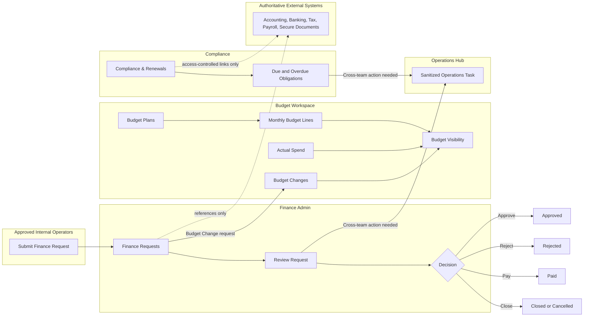

# EDU Passport Finance & Administration

## Executive Summary

The Finance & Administration Base is the restricted Corporate Services workflow base for EDU Passport finance and company administration.

It manages finance requests, USD budget planning, simple actual-spend visibility, compliance, contracts, renewals, and approval status without exposing sensitive finance details in the shared Operations Hub.

Companion docs:

- [Manual Test Scenarios](manual-test-scenarios.md)
- [Airtable AI Prompts](airtable-ai-prompts.md)

The base covers three operating areas:

- finance request intake and review
- monthly budget planning and budget-change tracking
- compliance, contracts, registrations, renewals, and basic administration obligations

The main operating rule is:

**Airtable tracks workflow status and approved metadata. External systems remain authoritative for accounting, banking, tax, payroll, secure documents, and transaction ledgers.**

This base should stay private and simple. It is not a replacement for accounting software, banking systems, payroll systems, tax filing systems, or secure document storage.

## Read Order

1. Use this README as the source of truth for the base schema, permissions, workflows, and acceptance tests.
2. Use [Airtable AI Prompts](airtable-ai-prompts.md) to create or revise the base, interfaces, and native automations.
3. Use [Manual Test Scenarios](manual-test-scenarios.md) to validate the MVP workflow before launch.

## Purpose

Provide a private Airtable workflow base for financial requests, company-wide budget planning, basic actual-spend visibility, contracts, registrations, and compliance without exposing detailed financial records in the shared Operations Hub.

This base is part of Milestone 8 and lives in the restricted `EDU Passport Corporate Services` workspace.

## Base Boundary

In scope:
- Purchase, expense, reimbursement, invoice, and payment-request workflows
- Monthly department/category budget planning in USD
- Quarterly, annual, and year-to-date budget reporting derived from monthly records
- Simple monthly actual-spend entry and over-budget visibility
- Controlled budget changes
- Contracts, company registrations, insurance, licenses, tax filings, and renewals
- Finance ownership, approval status, and due dates

Out of scope:
- General company project and task management
- Transaction-level accounting or the authoritative accounting ledger
- The authoritative bank record
- Banking credentials, full card data, passwords, or API keys
- Unrestricted financial, legal, or identity-document storage
- A duplicate Operations Hub Departments, Vendors, or Opportunities table

Accounting integration is deferred. Banking, tax, and secure document systems remain authoritative outside Airtable. Airtable stores planning data, simple actual-spend amounts, workflow status, approved metadata, references, and access-controlled links.

## Budget Operating Rules

- USD is the single reporting currency for Budget Plans and Budget Lines.
- One Budget Line represents one Budget Plan x Budget Category x Month.
- Monthly Budget Lines are the source for quarterly, annual, and YTD reporting.
- Do not create separate quarterly amount records or manually maintained quarterly totals.
- Department is a controlled single select maintained locally; no cross-base Departments sync is introduced.
- Approved operators may enter simple monthly Actual Spend for budget visibility.
- Do not import individual accounting transactions, bank details, or payment attachments.
- All department leads can view approved company-wide budget comparisons.
- During the MVP, a small approved internal operator group maintains planning, requests, actual-spend amounts, and compliance records.
- Revisit role-specific permissions when a dedicated Finance owner or department exists.
- An approved baseline is never overwritten. Post-approval changes use an approved Budget Change request.

## MVP Access Model

- Use one small approved internal operator group while there is no dedicated Finance department.
- Everyone in that group may use Budget Workspace and Finance Admin during setup.
- Keep the base private; do not publish interfaces or create public share links.
- Disable unrestricted invite links.
- Do not store bank details, credentials, transaction-level accounting data, payment attachments, payroll, or unrestricted identity/legal documents.
- Review role-specific permissions when a dedicated Finance owner or department exists.

## Tables

### Finance Requests

| Field | Type | Requirement |
| --- | --- | --- |
| Request ID | Autonumber or formula | Required stable identifier. |
| Request Type | Single select | Required: Purchase, Expense, Reimbursement, Invoice, Payment, Budget Change, Contract, Other. |
| Requester | Collaborator / created-by field | Required. |
| Vendor / Payee | Single line text | Required when applicable. |
| Amount | Currency | Required when applicable. |
| Currency | Single select | Required when Amount is used. |
| Due Date | Date | Required when applicable. |
| Approval Status | Single select | Required: Submitted, In Review, Approved, Rejected, Paid, Cancelled. |
| Finance Owner | Collaborator / Airtable user | Required after triage. |
| Related Budget Line | Linked record to Budget Lines | Required for Budget Change requests. |
| Budget Adjustment Amount | Currency, USD | Required signed value for Budget Change requests; positive increases budget and negative decreases it. |
| Approved Adjustment Value | Formula, currency | Returns the signed adjustment only when a Budget Change request is Approved. |
| Secure Document URL | URL | Optional access-controlled document-system link. |

Approved Adjustment Value:

```airtable
IF(
  AND(
    {Request Type} = "Budget Change",
    {Approval Status} = "Approved"
  ),
  {Budget Adjustment Amount},
  0
)
```

Budget Change requests remain at Approved after approval; the Paid status is reserved for payment-related requests.

### Budget Plans

One record per Department x Fiscal Year x planning cycle.

| Field | Type | Requirement |
| --- | --- | --- |
| Budget Plan Name | Formula | Required primary value derived from Department and Fiscal Year. |
| Department | Single select | Required controlled department value. |
| Fiscal Year | Number, integer | Required four-digit year. |
| Department Lead | Collaborator / Airtable user | Required for ownership and interface filtering. |
| Finance Owner | Collaborator / Airtable user | Required. |
| Currency | Single select | Required and fixed to USD for this version. |
| Status | Single select | Required: Draft, Submitted, Approved, Active, Closed. |
| Submitted Date | Date | Required when submitted. |
| Approved Date | Date | Required when approved. |
| Approved By | Collaborator / Airtable user | Required when approved. |
| Budget Lines | Linked records to Budget Lines | Backlink to monthly/category records. |
| Total Baseline Plan | Rollup | SUM of Budget Lines.Baseline Planned Amount. |
| Total Approved Adjustments | Rollup | SUM of Budget Lines.Approved Adjustments. |
| Total Current Budget | Rollup | SUM of Budget Lines.Current Budget. |
| Total Actual Spend | Rollup | SUM of Budget Lines.Actual Spend. |
| Notes | Long text | Optional planning-cycle context. |

Budget Plan Name:

```airtable
{Department} & " - FY" & {Fiscal Year}
```

Status behavior:
- Draft: MVP operators create or revise the baseline plan.
- Submitted: MVP operators review the plan before approval.
- Approved: Baseline is treated as the agreed plan.
- Active: Notes, actual-spend amounts, and approved changes are maintained during the cycle.
- Closed: The planning cycle is complete and kept for reporting.

### Budget Categories

| Field | Type | Requirement |
| --- | --- | --- |
| Category Name | Single line text | Required primary field. |
| Category Code | Single line text | Required unique code maintained by the approved operator group. |
| Category Group | Single select | Required controlled grouping maintained by Finance. |
| Active | Checkbox | Required; only active categories are available for new Budget Lines. |
| Description | Long text | Optional usage guidance. |
| Sort Order | Number, integer | Optional interface/report ordering. |

Finance owns category creation, codes, grouping, and activation.

### Budget Lines

One record per Budget Plan x Budget Category x Month. The Month value uses the first day of the reporting month.

| Field | Type | Requirement |
| --- | --- | --- |
| Budget Line Name | Formula | Required primary value, normally Department + Category + Month. |
| Budget Plan | Linked record to Budget Plans | Required, one plan. |
| Budget Category | Linked record to Budget Categories | Required, one active category. |
| Month | Date | Required; store the first day of the reporting month. |
| Quarter | Formula | Derived from Month; never entered manually. |
| Department | Lookup from Budget Plan | Required reporting and filtering value. |
| Department Lead | Lookup from Budget Plan | Required current-user filtering value. |
| Fiscal Year | Lookup from Budget Plan | Required reporting value. |
| Currency | Lookup from Budget Plan | Must resolve to USD. |
| Baseline Planned Amount | Currency, USD | Required baseline planning value. |
| Finance Requests | Linked records from Finance Requests | Backlink for Budget Change requests. |
| Approved Adjustments | Rollup | SUM of Finance Requests.Approved Adjustment Value. |
| Current Budget | Formula, currency | Baseline Planned Amount plus Approved Adjustments. |
| Actual Spend | Currency, USD | Simple operator-entered spend amount for budget visibility. |
| Over Budget Status | Formula | Over Budget when Actual Spend exceeds Current Budget. |
| Department Notes | Long text | Planning or department context notes. |

Budget Line Name:

```airtable
ARRAYJOIN({Department}) &
" - " &
ARRAYJOIN({Budget Category}) &
" - " &
DATETIME_FORMAT({Month}, "YYYY-MM")
```

Quarter:

```airtable
IF(
  {Month},
  "Q" & ROUNDUP(MONTH({Month}) / 3, 0)
)
```

Current Budget:

```airtable
{Baseline Planned Amount} + {Approved Adjustments}
```

Over Budget Status:

```airtable
IF(
  {Actual Spend} > {Current Budget},
  "Over Budget",
  "Within Budget"
)
```

Quarterly, annual, and YTD reports group or filter Budget Lines by Department, Fiscal Year, Quarter, Month, and Budget Category. They do not store separate quarterly or annual values.

### Compliance & Renewals

| Field | Type | Requirement |
| --- | --- | --- |
| Item | Single line text | Required primary field. |
| Category | Single select | Required: Registration, License, Insurance, Contract, Tax, Filing, Other. |
| Owner | Collaborator / Airtable user | Required. |
| Authority / Vendor | Single line text | Optional. |
| Due Date | Date | Required. |
| Status | Single select | Required: Upcoming, In Progress, Waiting, Completed, Overdue, Not Required. |
| Last Completed Date | Date | Optional. |
| Secure Document URL | URL | Optional access-controlled document-system link. |

Do not add a Vendors table in Milestone 8. Add one later only if vendor metadata cannot be managed through Finance Requests or an authoritative external finance system.

## Interfaces

Start with three MVP interfaces. Keep the pages practical for setup and early use; revisit role-specific access and page separation after a dedicated Finance owner or department exists.

### Finance Request Portal

Primary users: Approved internal operators submitting or reviewing purchase, expense, reimbursement, invoice, payment, budget-change, or contract requests.

Pages:
- New Request
- Request List
- Request Detail

Capabilities:
- Submit any Finance Request, including Budget Change requests, from New Request.
- Review request status, owner, due date, amount, and non-sensitive context.
- Use Related Budget Line and Budget Adjustment Amount only when Request Type is Budget Change.
- Keep secure source documents in the external document system and store only access-controlled URLs or references when needed.

### Budget Workspace

Primary users: Approved internal operators managing basic budget planning, actual-spend entry, and review.

Pages:
- Budget Overview
- Budget Planning
- Budget Changes

Capabilities:
- Budget Overview shows approved and active budget summaries, monthly totals, YTD totals, actual spend, and over-budget lines.
- Budget Planning provides a simple shared planning view for Budget Plans and Budget Lines.
- Budget Changes supports reviewing Budget Change requests and their budget impact.
- Quarterly, annual, and YTD reporting still comes from monthly Budget Lines.
- Approved baselines should not be silently overwritten; use Budget Change requests for post-approval changes.

### Finance Admin

Primary users: Approved internal operators handling basic request review, compliance, and budget setup.

Pages:
- Request Review
- Compliance & Renewals
- Budget Setup

Capabilities:
- Request Review supports reviewing Finance Requests and updating status, owner, due date, and payment/review context.
- Compliance & Renewals tracks upcoming, overdue, in-progress, and completed obligations.
- Budget Setup maintains Budget Plans and Budget Categories.
- Do not show or import transaction-level accounting records, bank data, credentials, payroll, unrestricted identity/legal documents, or payment attachments.

## Workflow Diagram



## Workflow

```text
Request submitted
    -> Review
    -> Approve / Reject / Pay / Close

Budget plan created
    -> Monthly Budget Lines filled
    -> Actual Spend updated for basic visibility when known
    -> Budget Change logged when approved changes are needed

Compliance item tracked
    -> Upcoming / In Progress / Waiting
    -> Completed or kept visible until resolved
```

When Operations or another team must act, create a sanitized Operations Hub Task without amounts, bank data, payment attachments, confidential approval notes, or restricted contract details.

## Formulas And Native Automations

- Calculate Quarter, Current Budget, and Over Budget Status on Budget Lines.
- Roll approved Budget Change values into Approved Adjustments without replacing Baseline Planned Amount. This is a formula and rollup relationship, not an automation.
- Use `Finance - Daily Admin Digest` as the starter daily review automation for Submitted or In Review Finance Requests, submitted Budget Plans, over-budget Budget Lines, and due or overdue Compliance & Renewals.
- Do not create separate real-time starter alerts for submitted plans, over-budget lines, or compliance due dates; review those through the daily digest and Finance Admin views.
- Do not automate transaction imports in Milestone 8; external accounting integration remains Milestone 9 work.

## Cross-Base Rule

Launch without cross-base synchronization.

Any later summary requires explicit approval and must be one-way, non-sensitive, and field-allowlisted. Do not sync department budget amounts, bank details, payment attachments, confidential notes, detailed transactions, restricted contracts, or tax records into the Operations Hub.

## Scenario Coverage

This section clarifies what the current Finance & Administration Base covers now and what remains outside the Airtable-only MVP.

### Covered Now

- Finance request intake for purchases, expenses, reimbursements, invoices, payments, budget changes, contracts, and other approved request types.
- Request review, basic approval status, Finance Owner assignment, due dates, and payment-status tracking.
- USD budget planning through Budget Plans, Budget Categories, and monthly Budget Lines.
- Quarterly, annual, and YTD budget reporting derived from monthly Budget Lines.
- Controlled budget changes through approved Budget Change requests.
- Simple actual-spend visibility, current-budget calculation, and over-budget review.
- Compliance, registration, insurance, contract, tax, filing, and renewal tracking.
- Sanitized Operations Hub handoff when another team must act without seeing restricted finance details.

### Partially Covered Now

- Department-wide budget visibility and role-based review are structurally supported, but final visibility depends on actual Airtable base, interface, and permission configuration.
- Actual Spend supports simple manual visibility only. It is not an accounting sync and does not reconcile transaction-level records.

### Not Covered Or Deferred

- Transaction-level accounting records.
- Authoritative bank records, banking credentials, full card data, or payment attachments.
- Payroll processing or payroll source-of-truth records.
- Secure document storage inside Airtable.
- Accounting, banking, tax, payroll, or secure-document integrations.
- Tax or accounting source-of-truth workflows.
- Cross-base synchronization into the Operations Hub.
- Unrestricted Finance visibility for general staff.

## Acceptance Tests

1. Create one USD Budget Plan for a department and fiscal year.
2. Create monthly Budget Lines for multiple categories and confirm no separate quarterly records are required.
3. Confirm monthly Baseline Planned Amount rolls up to the Budget Plan and groups correctly by Quarter and fiscal year.
4. Confirm Budget Workspace includes Budget Overview, Budget Planning, and Budget Changes pages.
5. Confirm Finance Admin includes Request Review, Compliance & Renewals, and Budget Setup pages.
6. Confirm the approved internal operator group can use the Budget Workspace and Finance Admin pages during the MVP.
7. Approve a plan and confirm post-approval changes use Budget Change requests rather than silently overwriting Baseline Planned Amount.
8. Approve a positive and a negative Budget Change and confirm Current Budget changes while the baseline remains unchanged.
9. Reject or cancel a Budget Change and confirm it contributes zero to Approved Adjustments.
10. Enter Actual Spend below and above Current Budget and verify Over Budget Status.
11. Confirm quarterly, annual, and YTD totals aggregate from monthly Budget Lines.
12. Confirm the Daily Admin Digest identifies Submitted or In Review Finance Requests, submitted Budget Plans, over-budget Budget Lines, and due or overdue Compliance & Renewals.
13. Confirm budget information remains inside the private Finance & Administration Base.
14. Confirm no public share link, unrestricted invite link, or cross-base sync exists.
15. Confirm role-specific permissions are listed as a later review item, not an MVP launch blocker.

## Completion Checklist

- [ ] Create the base in the Corporate Services workspace.
- [ ] Create Finance Requests, Budget Plans, Budget Categories, Budget Lines, and Compliance & Renewals with the specified fields.
- [ ] Configure the formulas, lookups, rollups, and approved-adjustment relationship.
- [ ] Create the three starter interfaces: Finance Request Portal, Budget Workspace, and Finance Admin.
- [ ] Configure the MVP approved internal operator group.
- [ ] Confirm role-specific Finance permissions are deferred until a dedicated owner or department exists.
- [ ] Configure the Finance daily admin digest automation.
- [ ] Disable public sharing and unrestricted invite links.
- [ ] Document that accounting integration is deferred and identify the authoritative banking, tax, and secure document systems.
- [ ] Pass all acceptance and negative-access tests.
- [ ] Confirm no cross-base synchronization is enabled.

See [Milestone 8 Corporate Functions Requirements](../company-functions-requirements.md) for cross-base routing and Operations/AI coordination.
