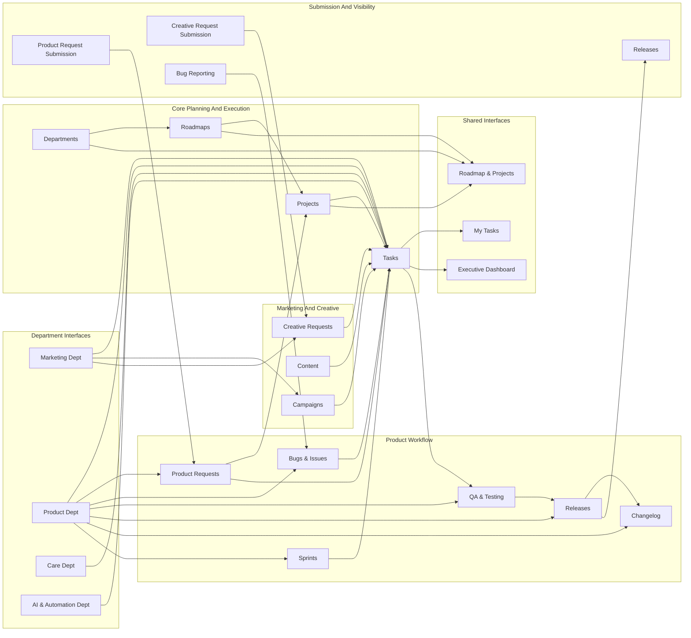

# EDU Passport Operations Hub

## Executive Summary

The EDU Passport Operations Hub is the main shared Airtable base for non-sensitive company execution.

It connects Departments, Roadmaps, Projects, Tasks, Product work, Marketing work, non-sensitive Operations, AI & Automation, and cross-department reporting in one place.

Companion docs:

- [Manual Test Scenarios](manual-test-scenarios.md)
- [Airtable AI Prompts](airtable-ai-prompts.md)

The Operations Hub is the execution system:

- Roadmaps explain strategic direction.
- Projects organize work by department and initiative.
- Tasks are the shared execution records for all non-sensitive work.
- Product, Marketing, Operations, and AI & Automation use shared Projects and Tasks for delivery.

The main operating rule is:

**One shared Tasks table. Every Operations Hub Task belongs to one Project.**

Care, CRM, scraped listing, Sales / Account Management, People & HR, and Finance & Administration workflows are routed to their dedicated bases. The Operations Hub may coordinate sanitized work, but it should not store restricted HR, Finance, Care, CRM, Sales pipeline, credential, banking, payroll, or secure-document details.

## Read Order

1. Use this README as the source of truth for Operations Hub scope, boundaries, and workflow direction.
2. Use [Airtable AI Prompts](airtable-ai-prompts.md) to create or revise the base, interfaces, and native automations.
3. Use [Manual Test Scenarios](manual-test-scenarios.md) to validate the Operations Hub before launch.
4. Use [Field Requirements](field-requirements.md) for core Departments, Roadmaps, Projects, and Tasks structure.
5. Use [Product Field Requirements](product-field-requirements.md) for Product workflow tables and shared Task links.
6. Use [Interface Requirements](interface-requirements.md) for dashboard and interface design.

Portfolio context:

1. [Repository README](../README.md)
2. [Architecture](../architecture.md)
3. [ERD](../ERD.md)
4. [Implementation](../implementation.md)
5. [Milestones](../milestones.md)
6. [Milestone 8 Corporate Functions Requirements](../company-functions-requirements.md)

## Purpose

Build the main company-wide Airtable hub for shared roadmaps, project management, task management, Product, Marketing, non-sensitive Operations, AI & Automation, and cross-department reporting.

## Base Strategy

- Main shared base: `EDU Passport Operations Hub`.
- Non-sensitive administration stays under Operations in the Operations Hub.
- AI & Automation is a dedicated department in the Operations Hub and uses shared Projects and Tasks.
- Sales and Account Management pipeline lives in the separate `Care & Sales Base`.
- Care, CRM, and scraped listing workflows live in the separate `Care & Sales Base`.
- Restricted workspace: `EDU Passport Corporate Services`.
- Restricted workflow bases: [EDU Passport People & HR](../People%20%26%20HR%20Base/README.md) and [EDU Passport Finance & Administration](../Finance%20%26%20Administration%20Base/README.md).
- Payroll, accounting, banking, HRIS, tax, and secure document systems remain authoritative outside Airtable.

## Core Operating Rules

1. One shared `Tasks` table remains the execution source of truth inside the Operations Hub.
2. Every Operations Hub Task belongs to one `Project`.
3. Use Airtable collaborator/user fields directly for owners and assignees.
4. Do not create a `Team Members` table in the Operations Hub.
5. Do not create an `Opportunities` table in the Operations Hub.
6. Do not create Care, CRM, or scraped-listing workflow tables in the Operations Hub.
7. Do not add HR or Finance restricted data to the Operations Hub.
8. Use sanitized Tasks only when another team needs to coordinate from a restricted or external workflow.
9. Prefer native Airtable automations first.
10. Do not store credentials, API keys, banking details, authoritative payroll/accounting records, payment attachments, or unrestricted sensitive documents in Airtable.

## Main Tables

### Core Execution

- `Departments`: company departments such as Marketing, Product, Operations, AI & Automation, and Leadership.
- `Roadmaps`: strategic plans grouped by department, year, quarter, and owner.
- `Projects`: delivery containers linked to Departments and Roadmaps.
- `Tasks`: shared execution records linked to Projects, owners, statuses, priorities, and due dates.

### Product

- `Product Requests`: internal product intake and triage.
- `Product Areas`: product taxonomy and ownership context.
- `Bugs & Issues`: confirmed defects and platform issues.
- `QA & Testing`: test cases, validation records, blockers, and results.
- `Releases`: release batches and launch readiness.
- `Changelog`: internal and user-facing change messages.

Product execution remains visible in shared `Projects` and `Tasks`.

### Marketing And Creative

- `Campaigns`: marketing campaign context already used by the existing Marketing workflow.
- `Content`: content planning and publishing context already used by the existing Marketing workflow.
- `Creative Requests`: creative-service intake where already present.

Marketing execution still belongs in shared `Tasks`.

### Operations

Operations uses shared `Projects` and `Tasks` for non-sensitive administration, recurring work, vendor coordination, facilities, equipment, and cross-team operational follow-up.

Do not use Operations tasks to store restricted Finance, HR, Care, CRM, Sales, banking, payroll, legal, tax, or secure-document details.

### AI & Automation

AI & Automation uses shared `Projects` and `Tasks` for company-wide AI, automation, integration, reporting, and operational delivery work.

Do not store credentials, API keys, passwords, source-system secrets, or restricted implementation details in Airtable.

## Operational Base Diagram

## Current Status

- Shared foundation and department workflows: Complete
- Interfaces and access guardrails: Complete
- Native automations: Complete
- Validation and reporting: Complete
- Sales / Account Management pipeline: Complete in Care & Sales Base
- Corporate functions, Operations, and AI & Automation: Current
- Future integrations: Planned

## Resume Context

Current Phase: Milestone 8 - Corporate Functions, Operations, And AI & Automation

Next:

- Confirm the Operations department and non-sensitive administration routing.
- Create the dedicated AI & Automation department, roadmap, interface, projects, and task workflows in the Operations Hub.
- Create the restricted Corporate Services workspace.
- Create the [People & HR](../People%20%26%20HR%20Base/README.md) and [Finance & Administration](../Finance%20%26%20Administration%20Base/README.md) bases.
- Configure base-specific or interface-only access and test sensitive-data boundaries.
- Launch without cross-base synchronization.

Constraints:

- One shared Tasks table remains the execution source of truth inside the Operations Hub.
- Every Operations Hub Task belongs to one Project.
- Paid Airtable features are acceptable when they improve interface and permission design.
- Prefer native automations first.
- Use interface guardrails inside shared bases and separate restricted bases when confidentiality requires data isolation.
- Do not store credentials, authoritative payroll/accounting records, or unrestricted sensitive documents in Airtable.

## Scenario Coverage

This section clarifies what the Operations Hub covers now and what belongs elsewhere.

### Covered Now

- Department, roadmap, project, and task execution structure.
- Shared task ownership, status, priority, due dates, and one-level subtask progress.
- Product request intake, triage, bug tracking, QA, releases, and changelog workflow.
- Marketing campaign, content, creative-request context, and related execution tasks.
- Non-sensitive Operations projects and recurring administration tasks.
- AI & Automation department work, projects, and tasks.
- Executive Dashboard, My Tasks, Roadmap & Projects, department interfaces, request submission interfaces, and release visibility interfaces.
- Native Airtable reminders and digests for shared operational visibility.

### Partially Covered Now

- Interface permissions and role-specific page access are structurally defined, but final behavior depends on actual Airtable configuration.
- Marketing table details are preserved from the existing base and interface requirements rather than fully respecified here.
- AI & Automation delivery is tracked through Projects and Tasks, while production monitoring systems remain outside Airtable.
- Cross-base coordination is supported through sanitized manual handoffs, not automated synchronization.

### Not Covered Or Deferred

- Care, CRM, scraped listing, Sales, Account Management, or revenue pipeline workflows.
- HR workflows, employee lifecycle cases, payroll, compensation, performance, medical, or confidential employee records.
- Finance workflows, accounting records, banking details, payment attachments, contracts, tax records, or secure finance documents.
- Credentials, passwords, API keys, unrestricted secure documents, or source-system secrets.
- Cross-base synchronization between the Operations Hub and restricted or dedicated bases.
- External platform, HRIS, accounting, banking, Brevo, WhatsApp, EDU Inbox, or production monitoring integrations.

## Current Verdict

The Operations Hub is the shared execution and reporting system for non-sensitive company work.

It works best when Product, Marketing, Operations, and AI & Automation all plan through Roadmaps and Projects, then execute through the shared Tasks table.

Restricted and dedicated workflows stay outside the Operations Hub. Use sanitized handoffs only when shared execution is needed.
