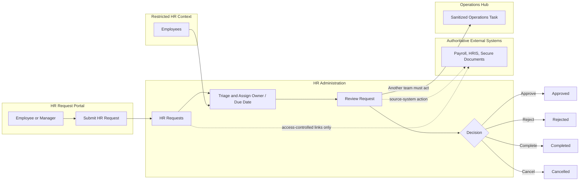

# EDU Passport People & HR

## Executive Summary

The People & HR Base is the restricted Corporate Services workflow base for EDU Passport employee lifecycle administration and confidential HR work.

It manages HR requests, recruitment, onboarding, offboarding, leave, document requests, employee changes, and confidential cases without exposing employee records or case details in the shared Operations Hub.

Companion docs:

- [Manual Test Scenarios](manual-test-scenarios.md)
- [Airtable AI Prompts](airtable-ai-prompts.md)

The base covers three operating areas:

- restricted employee lifecycle context
- HR request intake and triage
- confidential HR administration, approvals, and completion tracking

The main operating rule is:

**Airtable tracks HR workflow status and approved operational metadata. Payroll, HRIS, secure document systems, compensation records, and sensitive identity documents remain authoritative outside Airtable.**

This base should stay private and limited. It is not a general employee directory, payroll system, HRIS replacement, or secure document vault.

## Read Order

1. Use this README as the source of truth for the base schema, permissions, workflows, and acceptance tests.
2. Use [Airtable AI Prompts](airtable-ai-prompts.md) to create or revise the base, interfaces, and native automations.
3. Use [Manual Test Scenarios](manual-test-scenarios.md) to validate the HR workflow before launch.

## Purpose

Provide a restricted Airtable workflow base for employee lifecycle administration and confidential HR requests without exposing employee cases in the shared Operations Hub.

This base is part of Milestone 8 and lives in the restricted `EDU Passport Corporate Services` workspace.

## Base Boundary

In scope:
- Employee lifecycle status
- Recruitment, onboarding, offboarding, and leave workflows
- Employee document and employee-change requests
- Confidential HR case workflow
- HR ownership, due dates, approvals, and completion status

Out of scope:
- General company project and task management
- Payroll calculations or authoritative compensation records
- Banking credentials, full identity documents, passwords, or API keys
- A duplicate Operations Hub Team Members table

Payroll, HRIS, and secure document systems remain authoritative. Airtable stores workflow status, approved operational metadata, identifiers, and access-controlled links.

## Access Model

- Limit Corporate Services workspace ownership to designated leadership or system administrators.
- Give HR and approved leadership base-level access.
- Give ordinary employees interface-only access to request submission and their permitted request context where the Airtable plan supports it.
- Do not give general staff workspace-level access.
- Disable public sharing and unrestricted invite links.
- Restrict interface sharing to authorized owners or creators.
- Review workspace, base, interface, and share-link access quarterly and whenever a staff member changes role or leaves.

## Tables

### Employees

| Field | Type | Requirement |
| --- | --- | --- |
| Employee Name | Single line text | Required primary field. |
| Employment Status | Single select | Required: Candidate, Active, Leave, Exiting, Former. |
| Work Email | Email | Required for active employees. |
| Department | Single select or text | Required for active employees. No cross-base sync at launch. |
| Manager | Single line text or collaborator | Optional operational reference. |
| Start Date | Date | Required when known. |
| End Date | Date | Required for former employees when known. |
| HR Owner | Collaborator / Airtable user | Required. |
| External Payroll / HR Record URL | URL | Optional access-controlled source-system reference. |

The Employees table is the approved HR-specific exception to the deferred Team Members model. The Operations Hub continues using collaborator fields and does not receive an employee directory table.

### HR Requests

| Field | Type | Requirement |
| --- | --- | --- |
| Request ID | Autonumber or formula | Required stable identifier. |
| Request Type | Single select | Required: Recruitment, Onboarding, Offboarding, Leave, Employee Document, Employee Change, Confidential Case, Other. |
| Employee | Linked record to Employees | Required when the request concerns an employee. |
| Requester | Collaborator / created-by field | Required. |
| HR Owner | Collaborator / Airtable user | Required after triage. |
| Status | Single select | Required: Submitted, In Review, Waiting, Approved, Rejected, Completed, Cancelled. |
| Priority | Single select | Required: Low, Normal, High, Urgent. |
| Submitted Date | Created time | Required. |
| Due Date | Date | Required after triage when applicable. |
| Details | Long text | Required and visible only to the appropriate HR workflow. |
| Confidential Notes | Long text | Restricted to HR and approved leadership. |
| Secure Document URL | URL | Optional access-controlled document-system link. |

Do not add a general HR Tasks table in Milestone 8. Manage the request lifecycle on HR Requests and create only sanitized coordination Tasks in the Operations Hub when another department must act.

## Interfaces

### HR Request Portal

Primary users: Employees and managers submitting requests.

Capabilities:
- Submit an HR request
- See confirmation and permitted status information
- Prevent browsing of the Employees table, confidential notes, or other employees' requests

### HR Administration

Primary users: HR and approved leadership.

Capabilities:
- Triage new requests
- Assign HR owners and due dates
- Review urgent, waiting, and overdue work
- Update approvals and completion status
- Open access-controlled source-system or document links

## Workflow Diagram



## Workflow

```text
Employee / Manager submission
    -> HR Request
    -> HR triage and owner assignment
    -> Review / approval / source-system action
    -> Completed or rejected
```

When Operations, IT, or another team must act, create a sanitized Operations Hub Task that contains no employee case details, compensation, medical/performance information, or confidential attachments.

## Cross-Base Rule

Launch without cross-base synchronization.

Any later summary requires explicit approval and must be one-way, non-sensitive, and field-allowlisted. Do not sync employee names tied to cases, compensation, performance or medical data, confidential notes, or identity documents into the Operations Hub.

## Scenario Coverage

This section clarifies what the current People & HR Base covers now and what remains outside the Airtable-only MVP.

### Covered Now

- Employee lifecycle status for candidates, active employees, leave, exiting employees, and former employees.
- HR request intake for recruitment, onboarding, offboarding, leave, employee documents, employee changes, confidential cases, and other approved request types.
- HR triage, HR Owner assignment, due dates, request priority, approvals, rejection, completion, and cancellation status.
- Restricted HR administration for HR and approved leadership.
- Confidential Notes and Secure Document URL fields for controlled HR context and external document references.
- Sanitized Operations Hub handoff when Operations, IT, or another team must act without seeing employee case details.

### Partially Covered Now

- Employee self-service visibility and manager or requester access are structurally supported, but exact restrictions depend on Airtable plan, interface, and permission configuration.
- Manager references are supported as operational metadata, but may be implemented as either text or collaborator fields depending on the actual Airtable setup.

### Not Covered Or Deferred

- Payroll calculations or payroll source-of-truth records.
- Authoritative compensation records.
- Full HRIS replacement.
- Unrestricted employee directory access.
- Full identity document storage or confidential attachment storage inside Airtable.
- Banking credentials, passwords, API keys, or sensitive identity documents.
- Cross-base synchronization into the Operations Hub.
- HR case data, compensation data, performance data, medical data, or confidential notes in the Operations Hub.

## Acceptance Tests

1. An employee can submit an HR request without opening the underlying base.
2. An ordinary employee cannot view the Employees table, other employees' requests, or Confidential Notes.
3. HR can triage, assign, approve, reject, and complete requests.
4. A sanitized onboarding coordination Task can be created in the Operations Hub without exposing the employee case.
5. Payroll and secure documents remain in their authoritative systems.
6. No public share link, unrestricted invite link, or cross-base sync exists.
7. Removing a test user from the approved interface/base access removes their HR visibility.

## Completion Checklist

- [ ] Create the base in the Corporate Services workspace.
- [ ] Create Employees and HR Requests with the specified fields.
- [ ] Create HR Request Portal and HR Administration interfaces.
- [ ] Configure base-specific and interface-only access.
- [ ] Disable public and unrestricted sharing.
- [ ] Document the authoritative payroll, HRIS, and secure document systems.
- [ ] Pass all acceptance and negative-access tests.
- [ ] Confirm no cross-base synchronization is enabled.

See [Milestone 8 Corporate Functions Requirements](../company-functions-requirements.md) for cross-base routing and Operations/AI coordination.
