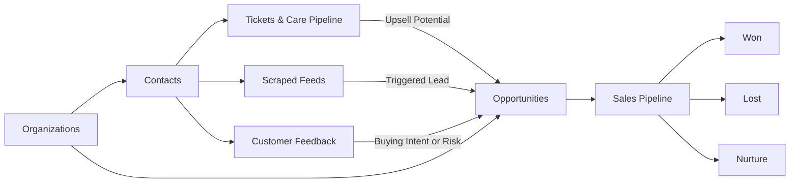
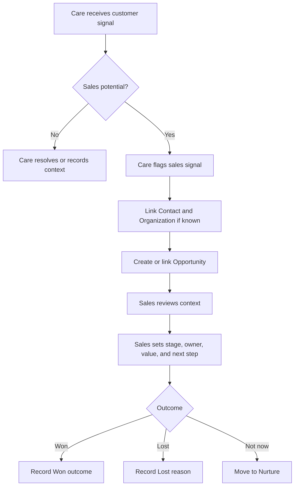
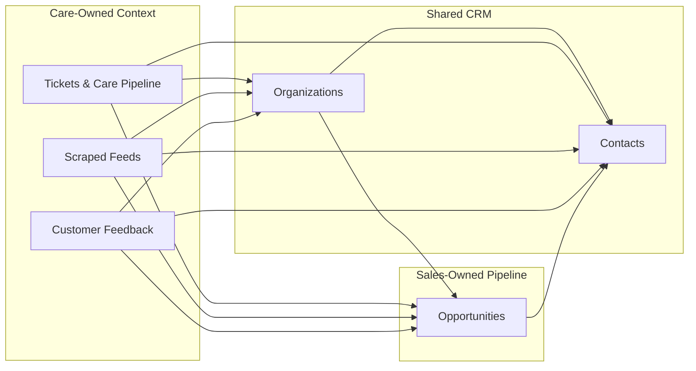

# Care & Sales Base

## Executive Summary

The Care & Sales Base is the shared customer lifecycle base for EDU Passport.

It connects Care, support, scraped market signals, customer feedback, and Sales / Account Management in one place so the team can see the full customer journey without duplicating contacts or losing handoff context.

Care owns the customer signal:

- support tickets
- upsell potential
- scraped external leads
- customer feedback
- customer satisfaction and service context

Sales owns the commercial follow-up:

- opportunity stage
- sales owner
- estimated value
- probability
- next step
- expected close date
- won, lost, or nurture outcome

The main operating rule is:

**Care detects signals. Sales manages opportunities.**

This base should stay simple. Care tables explain what happened with the customer. The Opportunities table explains what Sales is doing next.

## Purpose

The Care & Sales Base helps the team manage:

- customer support and service issues
- scraped external leads
- customer feedback
- upsell signals
- sales and account management opportunities

It is not meant to become a heavy finance, contract, or task-management system. It is the shared place where customer context becomes qualified commercial follow-up.

## Core Principle

Care detects signals. Sales manages opportunities.

A Care record should explain what happened with the customer. An Opportunity should explain what Sales is doing next.

## Main Tables

### Contacts

Contacts stores individual people.

Use this table for:

- educators
- business users
- vendors
- admins
- leads
- existing platform users

Contacts should not become a sales pipeline. A contact can have many tickets, feedback records, scraped feed matches, and opportunities.

### Organizations

Organizations stores schools, businesses, vendors, partners, and other institutions.

Use this table for:

- schools
- companies
- vendors
- partners
- key accounts
- institutions with multiple contacts

Organizations should not become the sales pipeline. It gives account-level context.

One Organization can have many Contacts, tickets, feedback records, scraped feed matches, and opportunities.

Example:

- Organization: Bright Future School
- Contacts: principal, teacher, admin staff
- Opportunities: premium plan discussion, renewal, expansion
- Tickets: support issues from staff at that school

### Tickets & Care Pipeline

Tickets & Care Pipeline stores support and service conversations.

Use this table when a customer has:

- a technical issue
- account access problem
- billing question
- feature request
- general inquiry
- support conversation with upsell potential

Important Sales-related fields:

- `upsell potential`
- `opportunities`

If `upsell potential` is checked, Care is saying: "This ticket may be useful for Sales."

The `opportunities` field links the ticket to the Sales opportunity created from that signal.

### Scraped Feeds

Scraped Feeds stores external posts or market signals found outside EDU Passport.

Use this table for:

- job posts
- deal posts
- event posts
- external listings
- repeated posters
- contact details collected from public sources

If a scraped feed looks like a possible lead, link it to an Opportunity.

### Customer Feedback

Customer Feedback stores customer comments, satisfaction signals, complaints, requests, and buying intent.

Use this table when feedback shows:

- interest in premium features
- expansion potential
- renewal risk
- dissatisfaction that Sales or Account Management should know about
- customer demand from a school, company, or vendor

If feedback becomes commercially relevant, link it to an Opportunity.

### Opportunities

Opportunities is the Sales and Account Management pipeline.

Use this table only when Sales has something to manage.

An Opportunity may come from:

- a Care ticket
- a scraped feed
- customer feedback
- a referral
- manual Sales entry
- an existing customer conversation

Sales owns these fields:

- stage
- owner
- estimated value
- probability
- expected close date
- next step
- next step due date
- closed date
- lost reason
- notes

## Table Relationships

```text
Organizations ----------> Contacts
      |                     |
      |                     v
      |              Tickets & Care Pipeline ----\
      |              Scraped Feeds ---------------+--> Opportunities
      |              Customer Feedback ----------/
      |                                            ^
      +--------------------------------------------+
```

Contacts and Organizations are shared CRM context.

```text
Tickets & Care Pipeline ----\
Scraped Feeds ---------------+--> Opportunities
Customer Feedback ----------/
```

The three Care-side tables are sources of sales signals.

Opportunities is where Sales manages the actual pipeline. Opportunities should link to a Contact when possible and to an Organization when the account or institution is known.

## Workflow Diagram



## Workflow

### 1. Care Handles the Customer Signal

Care creates or updates one of these records:

- ticket
- scraped feed
- customer feedback

Care fills in the customer context and links the relevant contact.

### 2. Care Flags Sales Potential

Care marks the record as sales-relevant.

Examples:

- `upsell potential` is checked on a ticket
- scraped feed looks like a lead
- feedback shows buying intent

### 3. Sales Creates or Links an Opportunity

Sales creates an Opportunity and links it back to the source record.

Examples:

- ticket links to opportunity through `opportunities`
- scraped feed links to opportunity
- customer feedback links to opportunity

### 4. Sales Manages the Pipeline

Sales moves the Opportunity through stages:

```text
New -> Qualified -> Discovery -> Proposal -> Negotiation -> Won / Lost / Nurture
```

### 5. Outcome Is Recorded

When the Opportunity is finished, Sales marks it as:

- `Won`
- `Lost`
- `Nurture`

The source Care record remains as historical customer context.

## Care to Sales Handoff Flow



## Ownership Diagram



## What Belongs Where

### Put This in Care Tables

- support issue
- customer complaint
- feedback details
- scraped source URL
- raw contact info
- resolution note
- satisfaction rating
- upsell signal

### Put This in Opportunities

- sales stage
- deal value
- probability
- next sales step
- expected close date
- sales owner
- won or lost outcome
- lost reason

## Rules

1. Do not duplicate contacts.
2. Do not track sales stages inside Care tickets.
3. Do not use Opportunities for general support work.
4. Every Opportunity should link to a Contact when possible.
5. Every Opportunity should link back to its source if it came from Care.
6. Care can flag opportunities, but Sales owns the pipeline.
7. Sales should review Care context before outreach.

## Interfaces

### Care Interface

Care uses this to manage:

- tickets
- scraped feeds
- customer feedback
- support follow-up
- upsell signals

### Sales / Account Management Interface

Sales uses this to manage:

- pipeline board
- my opportunities
- care upsell handoffs
- triggered leads
- feedback opportunities
- contact context
- forecast dashboard
- closed outcomes

## Simple Example

A customer opens a support ticket and asks about premium features.

Care does this:

1. Creates or updates the ticket.
2. Checks `upsell potential`.
3. Links the customer contact.
4. Adds context in the resolution note or feedback field.

Sales does this:

1. Creates an Opportunity.
2. Links it to the ticket through `opportunities`.
3. Sets stage to `New` or `Qualified`.
4. Adds next step and expected close date.
5. Moves the Opportunity through the pipeline.

## Final Mental Model

Care is the listening system.

Sales is the follow-up system.

The base works best when Care captures the truth of the customer conversation, and Sales turns qualified signals into managed opportunities.
